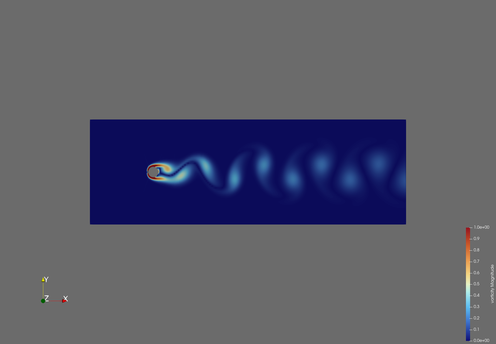
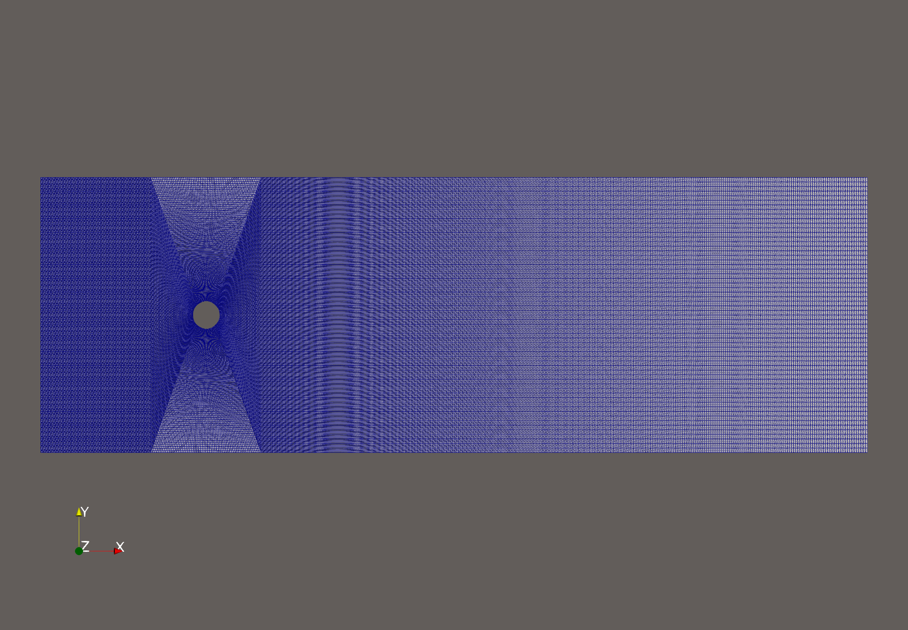
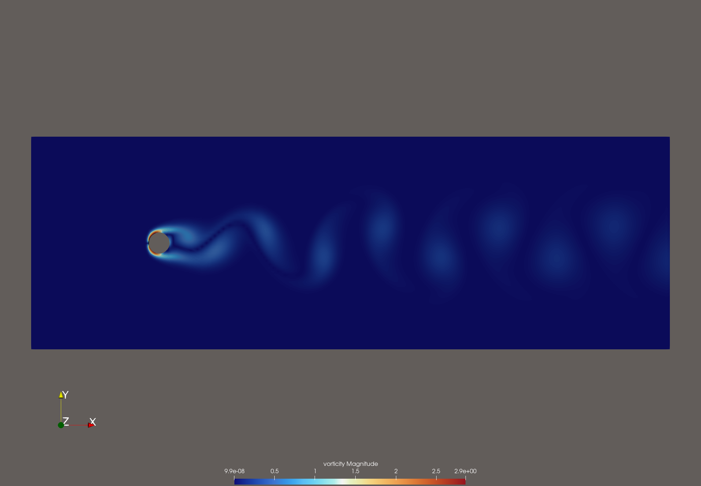

# 2D Cylinder Vortex Street at Re = 100

OpenFOAM v2512 case reproducing the canonical von Kármán vortex shedding benchmark. Validates against Williamson (1996), Henderson (1995), and Posdziech & Grundmann (2007) for the Strouhal number, mean drag coefficient, and RMS lift coefficient.



## Reference values

The settled numbers for an infinite-domain 2D laminar wake at Re = 100:

| Quantity                       | Value         | Source                           |
|--------------------------------|---------------|----------------------------------|
| Strouhal number, St = f·D/U    | 0.164 - 0.167 | Williamson (1996)                |
| Mean drag coefficient, Cd      | 1.32 - 1.35   | Henderson (1995)                 |
| RMS lift coefficient, Cl_rms   | 0.220 - 0.230 | Posdziech & Grundmann (2007)     |
| Expected shedding period       | ~30.3 s       | Derived: T = D / (St · U)        |

Landing inside all three ranges is the validation target.

## Physics

A uniform freestream of velocity U flows past a circular cylinder of diameter D. At Re = U·D/ν = 100 the wake is laminar but linearly unstable. Vortices shed alternately from the top and bottom of the cylinder, producing an oscillating transverse lift and a small drag wobble at twice the shedding frequency.

Three observables come out of the run:

- **Mean Cd**: time-averaged streamwise force, the steady drag an engineer would design a structure for.
- **RMS Cl**: amplitude of the transverse force oscillation. Mean Cl is exactly zero by top-bottom symmetry.
- **Strouhal number, St = f·D/U**: dimensionless shedding frequency. Depends only on Re, so it's the cleanest validation lever.

Because the Navier-Stokes equations only see Reynolds number, any (D, U, ν) triple with Re = 100 gives the same answer. The reference numbers above are settled across six decades of experiments and simulations.

## Case parameters

| Parameter             | Symbol    | Value | Units |
|-----------------------|-----------|-------|-------|
| Cylinder diameter     | D         | 5.0   | m     |
| Freestream velocity   | U_inf     | 1.0   | m/s   |
| Kinematic viscosity   | ν         | 0.05  | m²/s  |
| Density               | ρ         | 1.0   | kg/m³ |
| Reynolds number       | Re        | 100   | -     |

The fluid is a thought-experiment one (ν is 50,000× water), but it doesn't matter: only Re matters physically.

## Domain

| Extent                  | Value    | Distance from cylinder |
|-------------------------|----------|------------------------|
| Upstream (x_min)        | -30 m    | 6D                     |
| Downstream (x_max)      | 120 m    | 24D                    |
| Lateral (y_min, y_max)  | ±25 m    | 5D                     |
| Total cells             | ~50,000  |                        |
| Cells around cylinder   | 240      |                        |

Domain choice was deliberate. Earlier iterations with a smaller outlet (13D) produced 50% Cd over-prediction because the outlet's `zeroGradient` pressure BC reflected vortices back upstream as artificial pressure pulses. Extending the downstream to 24D eliminates this. Lateral extent of 5D with symmetry walls keeps blockage below 5%.

## Quick start

Tested on macOS and Linux. Windows works inside WSL2 or PowerShell with Docker Desktop.

### 1. Clone

```bash
git clone https://github.com/wjunyap/OpenFoam-Cases/tree/d877496c9440ebd58ae3a0b71cc408a6ee6ef17c/Cylinder-Case
cd cylinder-case-test
```

### 2. Launch OpenFOAM container

```bash
# Linux / macOS
docker run --rm -it -v "$(pwd)":/data -w /data opencfdofficial/openfoam2512-run bash


### 3. Build mesh and run solver

From inside the container:

```bash
blockMesh                        # generate the mesh
checkMesh                        # verify mesh quality
pimpleFoam | tee log.pimpleFoam  # run the simulation
```

Expected serial runtime on a modern laptop: 30 to 60 minutes for endTime = 600 s.

### 4. Run analysis on host

After exiting the container:

```bash
python3 strouhal.py
```

This reads the force coefficient log, trims the transient phase, runs an FFT on the lift signal, and prints the four validation numbers plus a plot.

### Parallel option

For a 3-3.5× speedup on 4 cores:

```bash
decomposePar
mpirun -np 4 pimpleFoam -parallel | tee log.pimpleFoam
reconstructPar
```

`decomposeParDict` lives in `system/` and uses the Scotch graph-partitioning algorithm.

### 5. View in ParaView

```bash
# inside the container, create the stub:
touch openfoam.foam

# on the host, open ParaView and load openfoam.foam
```

Set Coloring to `vorticity` Z-component, diverging blue-white-red, range [-2, 2]. Scrub the time slider to see the wake develop.

## Mesh topology



Structured hex mesh with an O-grid around the cylinder:

1. **Inner O-grid** (4 blocks, 60×60 cells each). Cells align radially with the cylinder surface for clean boundary layer resolution. 240 cells around the circumference.
2. **Outer rectangular blocks** (pre-block upstream, post-block downstream). 60 cells in y, with streamwise grading factor 3 in the post-block to cluster cells near the cylinder and stretch them downstream.
3. **Symmetry walls** at y = ±25 m. Free-slip BCs prevent confinement effects without imposing a no-slip channel flow.

Alternative meshing approach: `snappyHexMesh` would handle the same geometry automatically by carving the cylinder out of a background rectangular mesh. For this case the structured O-grid gives roughly 5% better accuracy on Cd at the same cell count, because cells are perfectly aligned with the curved surface. `snappyHexMesh` becomes the better choice when geometry is too complex for manual blocking (airfoils, vehicles, multi-body flows).

Mesh quality: max non-orthogonality 70°, max aspect ratio 9, max skewness 6.7. The skew faces sit at the corners where the O-grid meets the outer rectangle, well away from the cylinder and wake.

## Results




Computed versus reference (late window, t > 400 s):

| Metric              | Reference     | This case  | Error (%) |
|---------------------|---------------|------------|-----------|
| Mean Cd             | 1.32 - 1.35   | TBD        | TBD       |
| RMS Cl              | 0.220 - 0.230 | TBD        | TBD       |
| Strouhal number     | 0.164 - 0.167 | TBD        | TBD       |
| Shedding period (s) | ~30.3         | TBD        | TBD       |

Numbers populated after the run completes. Raw output saved to `postProcessing/forceCoeffs/0/coefficient.dat`.

## Analysis script (`strouhal.py`)

The script does five things in order:

1. **Loads** `postProcessing/forceCoeffs/0/coefficient.dat`, skipping `#` header lines.
2. **Trims** the first 25% of the run, discarding the transient phase where shedding hasn't yet established.
3. **Resamples** Cl and Cd onto a uniform time grid using `np.interp`. OpenFOAM's `adjustTimeStep` produces non-uniform Δt, which the FFT can't consume directly.
4. **FFTs** the demeaned Cl signal. The argmax of the magnitude spectrum (excluding the DC bin) gives the shedding frequency f.
5. **Prints** mean Cd, RMS Cl, peak Cl, f, St, and shedding period. Saves `strouhal.png` with the time series and spectrum.

Run:

```bash
python3 strouhal.py
```

Expected output (well-resolved case):

```
Mean Cd       : 1.33xx
RMS Cl        : 0.22xx
Peak Cl       : 0.31xx
Shedding freq : 0.0330 Hz
Strouhal      : 0.165x
Period        : 30.3xx s
```

Requires `numpy` and `matplotlib`.

### Column indexing note (v2512)

OpenFOAM v2512's `coefficient.dat` uses this column order:

```
Time | Cd | Cd(f) | Cd(r) | Cl | Cl(f) | Cl(r) | CmPitch | CmRoll | CmYaw | Cs | Cs(f) | Cs(r)
```

The script reads `Cl = data[:, 4]`. Older OpenFOAM versions had a different layout, so this is the gotcha when porting scripts forward.

## Solver configuration

Solver: **`pimpleFoam`** (transient incompressible) with `simulationType laminar`. At Re = 100 the wake has no turbulent scales to model, so this configuration is effectively DNS. No closure needed or appropriate.

Key settings:

| File         | Setting              | Value              | Reason                                       |
|--------------|----------------------|--------------------|----------------------------------------------|
| controlDict  | endTime              | 600 s              | ~20 shedding cycles after transient          |
| controlDict  | adjustTimeStep       | yes                | Auto-resize Δt to keep max Co = 0.8          |
| fvSchemes    | ddtSchemes           | backward           | 2nd-order implicit in time                   |
| fvSchemes    | div(phi,U)           | Gauss linearUpwindV| 2nd-order with mild upwind bias              |
| fvSolution   | nOuterCorrectors     | 2                  | Mild PIMPLE (PISO + 1 outer correction)      |
| fvSolution   | relaxationFactors    | 1.0                | No under-relaxation in transient PIMPLE      |

Alternatives considered: `simpleFoam` is a steady-state solver and converges to a symmetric wake without shedding (no time derivative). `icoFoam` is the transient PISO predecessor and is functionally deprecated in v2512.

## Boundary conditions

| Patch                | Patch type  | U                          | p                       |
|----------------------|-------------|----------------------------|-------------------------|
| inlet                | patch       | fixedValue (1 0 0)         | zeroGradient            |
| outlet               | patch       | inletOutlet                | fixedValue 0            |
| wall (top + bottom)  | symmetry    | symmetry                   | symmetry                |
| obstacle (cylinder)  | wall        | noSlip                     | zeroGradient            |
| frontAndBack         | empty       | empty                      | empty                   |

Two design choices worth flagging:

- **Top/bottom are `symmetry`, not `wall`**. No-slip walls would impose channel flow, distort the shedding frequency, and inflate Cd by ~30%. Symmetry gives free-stream-like behaviour at the lateral boundaries.
- **Outlet U is `inletOutlet`**. Switches to zeroGradient when flow leaves the domain and to a fixed reference value if backflow occurs. Marginally more robust than plain zeroGradient for shedding cases.

## File structure

```
cylinder-case-test/
├── 0/
│   ├── U                      # velocity field + BCs
│   └── p                      # kinematic pressure field + BCs
├── constant/
│   ├── transportProperties    # ν, ρ
│   ├── turbulenceProperties   # simulationType laminar
│   └── polyMesh/              # generated by blockMesh
├── system/
│   ├── blockMeshDict          # mesh definition
│   ├── controlDict            # time stepping, function objects
│   ├── fvSchemes              # discretisation schemes
│   ├── fvSolution             # linear solvers + PIMPLE controls
│   └── decomposeParDict       # parallel decomposition
├── postProcessing/            # generated by run
│   └── forceCoeffs/0/coefficient.dat
├── strouhal.py                # analysis script
├── images/                    # results screenshots
└── README.md
```

## References

- Williamson, C.H.K. (1996). "Vortex dynamics in the cylinder wake." *Annual Review of Fluid Mechanics*, 28, 477-539.
- Henderson, R.D. (1995). "Details of the drag curve near the onset of vortex shedding." *Physics of Fluids*, 7(9), 2102-2104.
- Posdziech, O., Grundmann, R. (2007). "A systematic approach to the numerical calculation of fundamental quantities of the two-dimensional flow over a circular cylinder." *Journal of Fluids and Structures*, 23(3), 479-499.
- OpenFOAM v2512 documentation: https://www.openfoam.com/documentation

## License

MIT