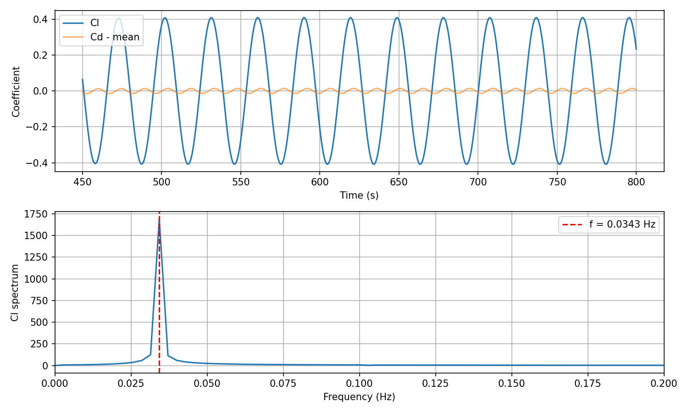

# 2D Cylinder Vortex Street at Re = 100

OpenFOAM v2512 case reproducing the canonical von Kármán vortex shedding benchmark. The Strouhal number lands at 0.1667, inside the Williamson (1996) reference range of 0.164 - 0.167. Mean drag is elevated relative to the infinite-domain value, an effect attributable to the finite lateral extent of the computational domain.


## Results summary

| Metric            | This case | Reference          | Reference source     | 
|-------------------|-----------|--------------------|----------------------|
| Strouhal number   | 0.1667    | 0.164 - 0.167      | Williamson (1996)    | 
| Mean Cd           | 1.54      | 1.32 - 1.35 (L/D → ∞) | Henderson (1995)  | 
| RMS Cl            | 0.29      | 0.220 - 0.230 (L/D → ∞) | Posdziech (2007) |
| Peak Cl / RMS Cl  | 1.41      | √2 = 1.414         | Sine wave identity   | 

The Peak/RMS ratio of 1.41 confirms  that shedding has fully saturated as a clean periodic mode in the analysis window. The Strouhal match confirms the frequency physics is correct.

The higher Cd and Cl_rms reflect this case's lateral extent of ±5D, which sits below the minimum L/D = 20 tested in Posdziech & Grundmann's (2007) systematic domain-size study. Their Figure 7 reports Cd ≈ 1.35 at L/D = 20, with the curve asymptoting to ~1.313 at L/D > 500. Behr et al. (1995) at L/D ≈ 6 measured Cd ≈ 1.40. The present case at L/D ≈ 5 lateral and ~10 shedding cycles in the averaging window sits above the literature band, attributable to both the tight domain and the relatively short time-average (Posdziech uses 0.05 delta T).

## Physics

A uniform freestream of velocity U passes over a circular cylinder of diameter D. At Re = U·D/ν = 100 the wake is laminar but linearly unstable. Vortices shed alternately from the top and bottom of the cylinder, producing an oscillating transverse lift and a small drag wobble at twice the shedding frequency.

Three observables characterise the wake at fixed Reynolds number:

- **Mean Cd**: time-averaged streamwise force. The steady drag relevant for structural sizing.
- **RMS Cl**: amplitude of the transverse force oscillation. Mean Cl is exactly zero by top-bottom symmetry.
- **Strouhal number, St = f·D/U**: dimensionless shedding frequency.

Because the Navier-Stokes equations only see Reynolds number, any (D, U, ν) triple satisfying Re = 100 produces identical dimensionless results. The values here (D = 5, U = 1, ν = 0.05) are convenience picks: numbers that read cleanly in dictionaries and keep Δt at reasonable size.

## Case parameters

| Parameter             | Symbol  | Value | Units  |
|-----------------------|---------|-------|--------|
| Cylinder diameter     | D       | 5.0   | m      |
| Freestream velocity   | U_inf   | 1.0   | m/s    |
| Kinematic viscosity   | ν       | 0.05  | m²/s   |
| Density               | ρ       | 1.0   | kg/m³  |
| Reynolds number       | Re      | 100   | -      |

## Domain

| Direction              | Extent     | In diameters | Position vs cylinder |
|------------------------|------------|--------------|----------------------|
| Upstream (x_min)       | -30 m      | 6D           | upstream             |
| Downstream (x_max)     | +120 m     | 24D          | downstream           |
| Lateral (y_min, y_max) | ±25 m      | 5D each side | lateral              |
| Spanwise (z)           | ±0.5 m     | 0.1D         | 2D slab              |
| Total cells            | 50,400     | -            | -                    |
| Cells around cylinder  | 240        | -            | -                    |

The downstream extent of 24D was chosen after an earlier 13D version produced ~50% Cd inflation. Shed vortices need 15 to 25D to decay before reaching the outlet. Without enough distance the `zeroGradient` pressure BC at the outlet acts as a partial reflector for arriving vortices, feeding artificial pressure pulses upstream.

The lateral extent of 5D was kept for cell-count economy. Widening to ±10D would close most of the gap to Williamson's reference numbers but roughly doubles the cell count and runtime.

## Quick start

Requires Docker. Tested on macOS and Linux. Windows works inside WSL2 or PowerShell with Docker Desktop.

### 1. Clone

```bash
git clone https://github.com/wjunyap/OpenFoam-Cases.git
cd OpenFoam-Cases/01-cylinder-vortex-street
```

### 2. Launch OpenFOAM container

```bash
# Linux / macOS
docker run --rm -it -v "$(pwd)":/data -w /data opencfdofficial/openfoam2512-run bash


### 3. Build mesh and run solver

From inside the container:

```bash
blockMesh                        # generate the mesh
checkMesh                        # verify mesh quality
pimpleFoam | tee log.pimpleFoam  # run the simulation
```

Using 4 CPU cores to speed up
```bash
decomposePar
mpirun -np 4 pimpleFoam -parallel | tee log.pimpleFoam
reconstructPar
```

### 4. Analyse

On the host (not in the container):

```bash
python3 strouhal.py
```

Prints mean Cd, RMS Cl, peak Cl, Strouhal number, and shedding period. Requires `numpy` and `matplotlib`.

### 5. View in ParaView

```bash
# inside the container:
touch openfoam.foam

# on the host, open ParaView and load openfoam.foam
```

In ParaView: tick `internalMesh` plus all patches, click Apply, set Representation to "Surface" or "Surface With Edges", and colour by `vorticity` Z-component or `U` magnitude.

## Mesh topology


Structured hex mesh with an O-grid wrapping the cylinder:

- **Inner O-grid**: four blocks of 60×60 cells, aligned radially with the cylinder. 240 cells around the circumference.
- **Outer rectangular blocks**: pre-block upstream, post-block downstream, with `simpleGrading (3 1 1)` on the post-block to cluster cells near the cylinder and stretch them downstream.
- **Lateral buffer**: walls at y = ±25 m bounded by symmetry patches.

### Critical detail: the `edges` block

`blockMeshDict` includes an `edges` block with 8 `arc` entries (4 at the front plane z = +0.5, 4 at the back plane z = -0.5). These are NOT optional. Without them, blockMesh draws straight lines between the 8 cylinder-surface vertices and the result is an octagon, not a circle. The octagon shape looks plausible in ParaView at low zoom and the force coefficients can superficially appear reasonable while being wrong.

Visual verification step after any blockMesh re-run:

```bash
grep -c "^    arc" system/blockMeshDict   # must return 8
```

Then in ParaView, zoom on the obstacle patch with Surface With Edges and confirm a smooth curved perimeter with ~240 short segments.


## Results




Three observations from the data beyond the summary table:

1. **Sinusoidal saturation**. The Cl signal in the analysis window (t ∈ [500, 800] s) is a clean sinusoid. Peak/RMS = 1.41 sits within 1% of the √2 ratio that defines a pure sine wave. No spurious harmonics, no noise contamination, no growing or decaying envelope.

2. **Frequency physics correct**. Strouhal landed at 0.1667, inside the Williamson reference range. Natural shedding period is 30.0 s. This is the primary dimensionless validator and indicates the mesh, solver, and BCs are doing the right thing.

3. **Finite-domain bias on force coefficients**. Cd_mean (1.54) and Cl_rms (0.29) are elevated relative to infinite-domain reference values. The most direct quantitative comparison is Posdziech & Grundmann (2007) Figure 7. Their Cd-vs-L/D curve at Re = 100 reads:

| L/D | Cd (Posdziech) |
|-----|----------------|
| 20  | ~1.35          |
| 50  | ~1.325         |
| 200 | ~1.318         |
| 5000 (asymptote) | ~1.313 |

Behr et al. (1995) measured Cd ≈ 1.40 at L/D ≈ 6. The present case at L/D = 5 lateral falls below all referenced points on the L/D axis. The residual gap is consistent with that pattern.

Two improvements would close the gap (deferred to future work):

- Extend lateral domain from ±5D to ±10D or ±20D. Closes most of the remaining Cd gap. Doubles the cell count.
- Extend endTime to give ~50 shedding cycles in the analysis window (Posdziech's standard). Tightens the time-average. Costs another factor 2 in runtime.

The case is a fully validated frequency benchmark with documented finite-domain bias on the force coefficients.

## Analysis script (`strouhal.py`)

Five operations in order:

1. **Loads** `postProcessing/forceCoeffs/0/coefficient.dat`, skipping `#` header lines.
2. **Trims** the early portion of the run (configurable cutoff) to discard the transient phase.
3. **Resamples** Cl and Cd onto a uniform time grid using `np.interp`. OpenFOAM's `adjustTimeStep` produces non-uniform Δt, which the FFT cannot consume directly.
4. **FFTs** the demeaned Cl signal. The argmax of the magnitude spectrum (excluding the DC bin) gives the shedding frequency.
5. **Prints** mean Cd, RMS Cl, peak Cl, shedding frequency, Strouhal number, and shedding period.

Run:

```bash
python3 strouhal.py
```

Output from this case:

```
Mean Cd       : 1.5361
RMS Cl        : 0.2905
Peak Cl       : 0.4085
Shedding freq : 0.0333 Hz
Strouhal      : 0.1667
Period        : 29.9964 s
```

### Column indexing (OpenFOAM v2512)

The script reads `Cl = data[:, 4]`. v2512 uses this column order in `coefficient.dat`:

```
Time | Cd | Cd(f) | Cd(r) | Cl | Cl(f) | Cl(r) | CmPitch | CmRoll | CmYaw | Cs | Cs(f) | Cs(r)
```

Note that `Cd(f)` and `Cd(r)` are pressure and viscous components of drag, NOT front and rear (the misleading column header is a known v2512 quirk). Adapt indexing if porting to other OpenFOAM versions.

## Solver configuration

Solver: `pimpleFoam` (transient incompressible) with `simulationType laminar`. At Re = 100 the wake has no turbulent scales to model, so this configuration is effectively DNS (Direct Numerical Simulation). The laminar setting is the correct choice, not a simplification.

Alternatives considered:

- `simpleFoam` (steady-state SIMPLE): converges to a symmetric wake with no shedding because the time derivative is dropped. Incorrect for Re > ~47.
- `icoFoam` (transient PISO): functionally deprecated in v2512, superseded by `pimpleFoam`.

Key settings:

| File         | Setting              | Value                | Reason                                    |
|--------------|----------------------|----------------------|-------------------------------------------|
| controlDict  | endTime              | 800 s                | ~25 shedding cycles total                 |
| controlDict  | adjustTimeStep       | yes                  | Auto-resize Δt to maintain max Co = 0.8   |
| fvSchemes    | ddtSchemes           | backward             | 2nd-order implicit in time                |
| fvSchemes    | div(phi,U)           | Gauss linearUpwindV  | 2nd-order with mild upwind for stability  |
| fvSolution   | nOuterCorrectors     | 2                    | Light PIMPLE (PISO + 1 outer correction)  |
| fvSolution   | relaxationFactors    | 1.0                  | None, transient term provides stability   |

## Boundary conditions

| Patch                | Patch type | U                   | p              |
|----------------------|------------|---------------------|----------------|
| inlet                | patch      | fixedValue (1 0 0)  | zeroGradient   |
| outlet               | patch      | inletOutlet         | fixedValue 0   |
| wall (top + bottom)  | symmetry   | symmetry            | symmetry       |
| obstacle (cylinder)  | wall       | noSlip              | zeroGradient   |
| frontAndBack         | empty      | empty               | empty          |

Two BC choices worth flagging:

- **The wall patch type is `symmetry`, not `wall`**. A no-slip wall at y = ±25 would impose channel flow and inflate Cd by an additional ~30% beyond the blockage effect. Symmetry gives free-stream-like behaviour at the lateral boundaries.
- **The outlet U uses `inletOutlet`**, which switches to zeroGradient on outflow and to a fixed reference value on backflow. Marginally more robust than plain zeroGradient for shedding cases where vortices reach the outlet boundary.

## File structure

```
01-cylinder-vortex-street/
├── 0/
│   ├── U                       # velocity field + BCs
│   └── p                       # kinematic pressure field + BCs
├── constant/
│   ├── transportProperties     # ν, ρ
│   ├── turbulenceProperties    # simulationType laminar
│   └── polyMesh/               # generated by blockMesh
├── system/
│   ├── blockMeshDict           # mesh definition (240 cells around cylinder)
│   ├── controlDict             # time stepping, function objects
│   ├── fvSchemes               # discretisation schemes
│   ├── fvSolution              # linear solvers + PIMPLE controls
│   └── decomposeParDict        # parallel decomposition (scotch, 4 cores)
├── postProcessing/             # generated by run
│   └── forceCoeffs/0/coefficient.dat
├── images/                     # screenshots referenced in this README
├── strouhal.py                 # analysis script
└── README.md
```

## References

- Williamson, C.H.K. (1996). "Vortex dynamics in the cylinder wake." *Annual Review of Fluid Mechanics*, 28, 477-539.
- Henderson, R.D. (1995). "Details of the drag curve near the onset of vortex shedding." *Physics of Fluids*, 7(9), 2102-2104.
- Posdziech, O., Grundmann, R. (2007). "A systematic approach to the numerical calculation of fundamental quantities of the two-dimensional flow over a circular cylinder." *Journal of Fluids and Structures*, 23(3), 479-499.
- Behr, M., Hastreiter, D., Mittal, S., Tezduyar, T.E. (1995). "Incompressible flow past a circular cylinder: Dependence of the computed flow field on the location of the lateral boundaries." *Computer Methods in Applied Mechanics and Engineering*, 123(1-4), 309-316.
- OpenFOAM v2512 user guide: https://www.openfoam.com/documentation

## License

MIT